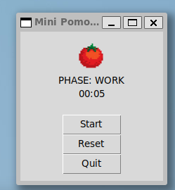

# A simple Pomodoro timer
A very simple productivity timer built with tkinter in Python. 

If you want to modify the length of each phase or even rename them, there's a 2D array that houses all the phase names and lengths. 

### Future enhancements
- Could add a task list below it
- Add the ability to change phase length in the UI